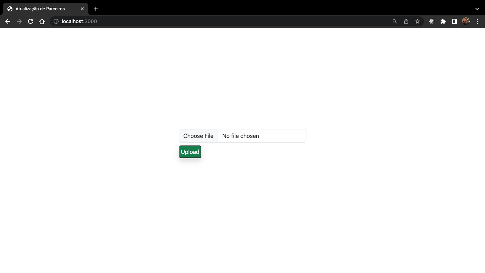
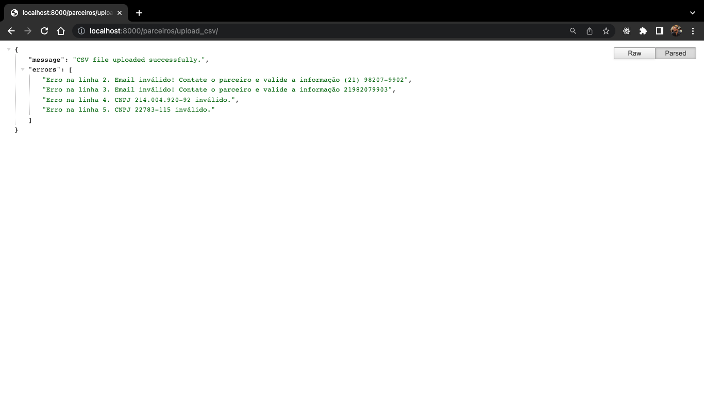
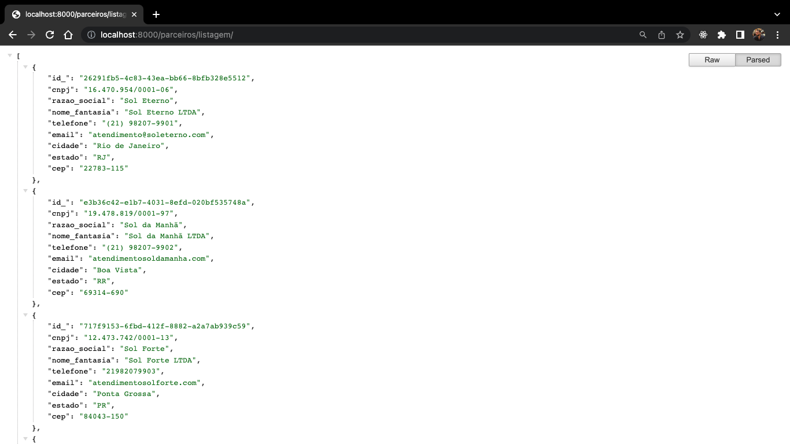
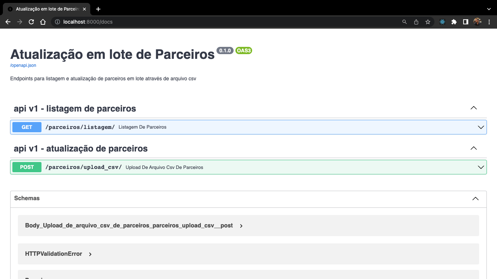
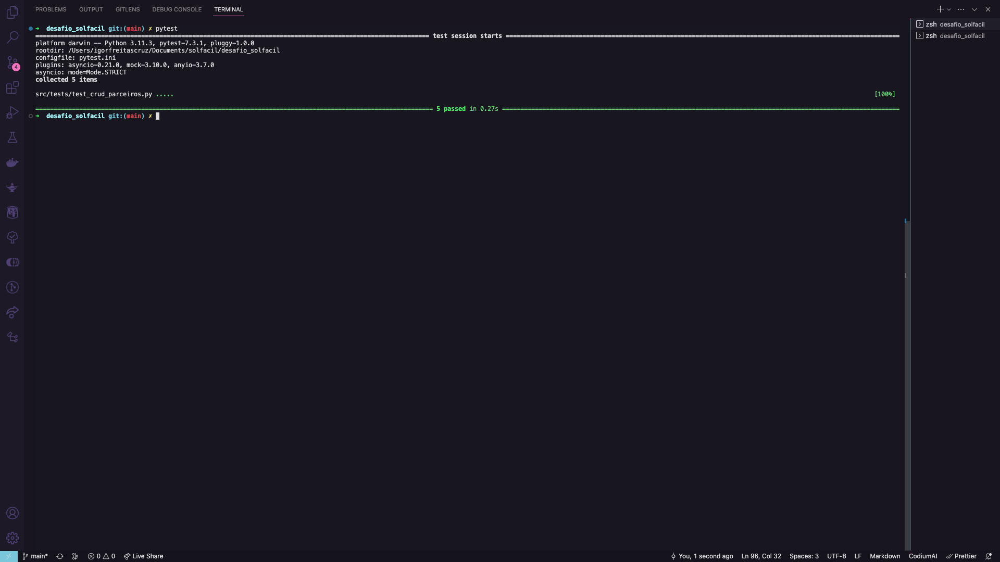

<!-- Title -->

<h1 align="center">
   Solfácil
</h1>

<!-- Description -->

<h3 align="center">
   Projeto de atualização em lote de parceiros via API
</h3>

<p align="center">
   
</p>

<br>

<!-- Table of content -->

Conteúdos
=================
- [Sobre o projeto](#sobre-o-projeto)
- [Funcionalidades](#funcionalidades)
- [Rodando a aplicação](#rodando-a-aplicação)
   - [Docker](#docker)
- [Exemplo API](#exemplo-da-api)
- [Tecnologias utilizadas no projeto](#tecnologias-utilizadas-no-projeto)
- [Autor](#autor)

---

## 💻 Sobre o projeto

Projeto para atualização rotineira dos dados dos parceiros da Solfácil.

---

## Funcionalidades

- [x] Endpoint para upload de arquivo csv (criar ou atualizar parceiro)
- [x] Endpoint para listagem dos parceiros

---

## Rodando a aplicação

```bash
# Faça o clone do repositório
$ git clone https://github.com/IgorFreitasCruz/desafio_solfacil-api.git .

# Acesso o diretório do projeot
$ cd desafio_solfacil
```

---

### Docker

```bash
# Execute o container da aplicação
$ docker-compose up -d
```

---

## Acessando a aplicação

### Upload de arquivo csv

Para ter acesso à aplicação acesse ```http://localhost:3000/```

Selecione o arquivo formato ```.csv``` para upload

<p align="center">
   
</p>

O resultado mostrado em tela será similar ao ilustrado abaixo:

<p align="center">
   
</p>

Caso ocorram erros de informação no arquivo os mesmos serão mostrados em tela.
   - Emails inválidos não proibem a criação de um novo parceiro.
   - CNPJ inválido não permite criar um novo parceiro

### Listagem de parceiros

Caso deseje listar todos os parceiros cadastrados acesse ```http://localhost:8000/parceiros/listagem```

<p align="center">
   
</p>

___

### Exemplo da API

<p align="center">
   
</p>

## Rodando os testes
```bash
# No diretório desafio_solfacil
$ pytest
```
<p align="center">
   
</p>

---

## Tecnologias utilizadas no projeto

-   FastAPI
-   Flask
-   Docker
-   Postgresql

---

## Autor
<a>
 
 <br />
 <sub><b>Igor de Freitas Cruz</b></sub></a> 🚀
 <br />

[](https://www.linkedin.com/in/igorfreitascruz/)
[](mailto:igor.freitas.cruz@icloud.com)

---

Made with ❤️ by Igor Cruz 👋🏻 [Contact me!](https://www.linkedin.com/in/igorfreitascruz/)